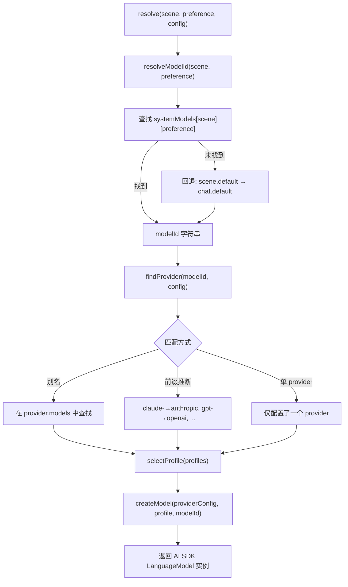
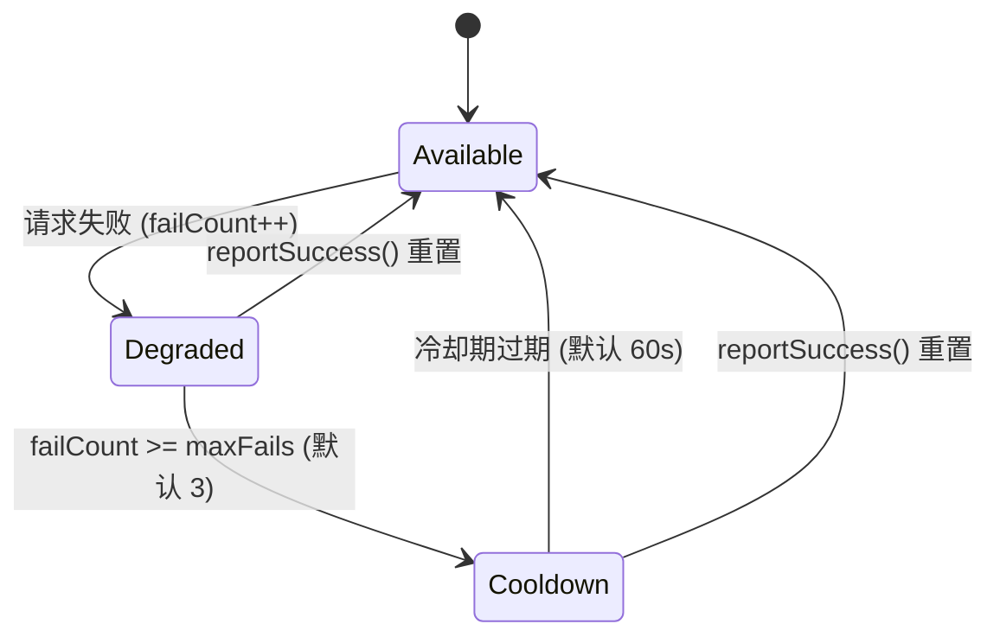
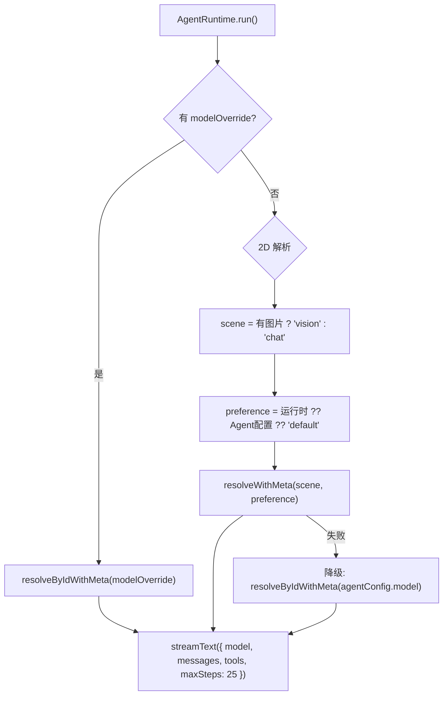
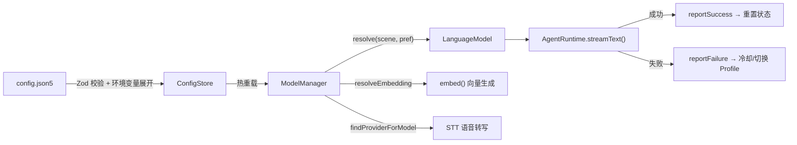

# 模型系统详解

YanClaw 的模型系统负责将配置中的 Provider/Profile/Model 映射到 AI SDK 实例，并提供多 Profile 负载均衡、故障冷却与自动恢复能力。

## 目录

- [配置结构](#配置结构)
- [模型解析流程](#模型解析流程)
- [多 Profile 负载均衡](#多-profile-负载均衡)
- [故障冷却与自动恢复](#故障冷却与自动恢复)
- [Agent Runtime 集成](#agent-runtime-集成)
- [嵌入与语音转写](#嵌入与语音转写)
- [关键文件索引](#关键文件索引)

---

## 配置结构

配置文件：`~/.yanclaw/config.json5`，Schema 定义于 `packages/server/src/config/schema.ts`。

### Provider 定义

```json5
{
  models: {
    providers: {
      anthropic: {
        type: "anthropic",                     // anthropic | openai | google | ollama | openai-compatible
        profiles: [
          { id: "primary", apiKey: "${ANTHROPIC_API_KEY}" },
          { id: "backup",  apiKey: "${ANTHROPIC_API_KEY_2}" }
        ],
        baseUrl: "https://custom-endpoint.example.com",  // 可选，覆盖默认 URL
        models: { "sonnet": "claude-sonnet-4-20250514" }  // 可选，模型别名映射
      },
      deepseek: {
        type: "openai-compatible",
        baseUrl: "https://api.deepseek.com/v1",
        profiles: [{ id: "default", apiKey: "${DEEPSEEK_API_KEY}" }]
      },
      ollama: {
        type: "ollama",
        baseUrl: "http://localhost:11434"       // 默认值
      }
    }
  }
}
```

支持 5 种 Provider 类型：

| 类型 | 说明 |
|------|------|
| `anthropic` | Anthropic Claude 系列 |
| `openai` | OpenAI GPT 系列 |
| `google` | Google Gemini 系列 |
| `ollama` | 本地 Ollama 推理 |
| `openai-compatible` | 兼容 OpenAI 接口的第三方服务（DeepSeek、Groq 等） |

### 2D 场景-偏好矩阵（systemModels）

模型选择通过 **场景（Scene）× 偏好（Preference）** 二维矩阵进行：

```json5
{
  systemModels: {
    chat: {
      default: "claude-sonnet-4-20250514",
      fast:    "claude-haiku-4-5-20251001",
      quality: "claude-opus-4-20250514",
      cheap:   "gpt-4o-mini"
    },
    vision: {
      default: "claude-opus-4-20250514",
      fast:    "claude-haiku-4-5-20251001"
    },
    embedding: "text-embedding-3-small",   // 字符串简写 = default 偏好
    stt: "whisper-1"
  }
}
```

**场景（Scene）**：`chat` | `vision` | `embedding` | `stt` | 自定义（回退到 `chat`）

**偏好（Preference）**：`default` | `fast` | `quality` | `cheap`

回退规则：指定偏好不存在 → `default` → 跨场景回退到 `chat`。

### 偏好的三层指定

偏好可在三个层级指定，优先级从高到低：

```
运行时 preference  >  Agent 配置 preference  >  路由绑定 preference  >  "default"
```

```json5
{
  // 路由绑定层
  routing: { bindings: [{ channel: "telegram", agent: "main", preference: "fast" }] },

  // Agent 层
  agents: [{ id: "main", preference: "quality" }]

  // 运行时层：agentRuntime.run({ preference: "fast" })
}
```

---

## 模型解析流程

核心实现：`packages/server/src/agents/model-manager.ts` — `ModelManager` 类。



### Provider 实例化

```typescript
// 根据 type 调用不同的 AI SDK 工厂
switch (providerConfig.type) {
  case "anthropic":    → createAnthropic({ apiKey, baseURL })(modelId)
  case "openai":       → createOpenAI({ apiKey, baseURL })(modelId)
  case "openai-compatible": → createOpenAI({ apiKey, baseURL, compatibility: "compatible" })(modelId)
  case "google":       → createGoogleGenerativeAI({ apiKey, baseURL })(modelId)
  case "ollama":       → createOpenAI({ apiKey: "ollama", baseURL: "http://localhost:11434/v1" })(modelId)
}
```

### 模型 ID 前缀推断规则

| 前缀 | 推断 Provider |
|------|--------------|
| `claude-` | anthropic |
| `gpt-`, `o1-`, `o3-`, `o4-`, `chatgpt-` | openai |
| `gemini-` | google |

---

## 多 Profile 负载均衡

每个 Provider 可配置多个 Profile（各持有独立 API Key），系统通过 **Round-Robin** 轮询实现负载均衡。

```
Provider: anthropic
  Profiles: [primary, backup, secondary]

请求序列: primary → backup → secondary → primary → ...
```

状态跟踪：

```typescript
// 以 "providerName:profileId" 为 key 维护状态
interface ProfileState {
  failCount: number;       // 连续失败次数
  cooldownUntil: number;   // 冷却截止时间戳
}
```

选择逻辑：
1. 过滤掉处于冷却期的 Profile
2. 在可用 Profile 中 Round-Robin 轮询
3. 若全部冷却，降级使用第一个 Profile（保证可用性）

---

## 故障冷却与自动恢复



| 参数 | 默认值 | 说明 |
|------|--------|------|
| `maxFails` | 3 | 触发冷却的连续失败次数 |
| `cooldownMs` | 60,000 ms | 冷却持续时间 |

**关键方法：**

- `reportFailure(provider, profileId)` — 递增失败计数，达到阈值后触发冷却
- `reportSuccess(provider, profileId)` — 清除该 Profile 所有失败状态
- `getProfileStatus(provider, profileId)` — 返回 `"available"` | `"cooldown"` | `"failed"`

**自动恢复**：冷却期到期后，下次调用 `selectProfile()` 时自动检测并恢复为可用状态，无需额外触发。

---

## Agent Runtime 集成

核心实现：`packages/server/src/agents/runtime.ts`

### 模型选择优先级



### 调用与反馈

```typescript
// 调用
const result = streamText({
  model,                    // ModelManager 返回的 LanguageModel
  messages,                 // 系统提示 + 历史消息 + 用户输入
  tools,                    // 经 toolPolicy 过滤的工具集
  maxSteps: 25,             // 最大工具调用轮次
  abortSignal: signal,
});

// 流式消费
for await (const part of result.fullStream) {
  // 处理: text-delta, reasoning, tool-call, tool-result, error
}

// 反馈到 ModelManager
const usage = await result.usage;
modelManager.reportSuccess(provider, profileId);  // 成功
modelManager.reportFailure(provider, profileId);  // 失败
```

---

## 嵌入与语音转写

### 嵌入模型

`packages/server/src/memory/embeddings.ts`

```typescript
const model = modelManager.resolveEmbedding(config, config.memory.embeddingModel);
const { embedding } = await embed({ model, value: text });
```

默认模型：`text-embedding-3-small`，可通过 `systemModels.embedding` 或 `memory.embeddingModel` 覆盖。

### 语音转写（STT）

`packages/server/src/media/stt.ts`

通过 `systemModels.stt` 解析模型 ID，直接调用 OpenAI 兼容的 `/audio/transcriptions` HTTP 端点。

---

## 关键文件索引

| 文件路径 | 职责 |
|----------|------|
| `server/src/config/schema.ts` | Zod Schema：Provider、Profile、Scene、Preference 定义 |
| `server/src/agents/model-manager.ts` | 模型解析引擎：负载均衡、故障冷却、Provider 实例化 |
| `server/src/agents/runtime.ts` | Agent 执行：模型选择、streamText 调用、成功/失败反馈 |
| `server/src/config/store.ts` | 配置加载：JSON5 解析、环境变量展开、热重载、格式迁移 |
| `server/src/memory/embeddings.ts` | 嵌入向量生成 |
| `server/src/media/stt.ts` | 语音转写服务 |
| `server/src/gateway.ts` | 网关初始化：创建 ModelManager 单例并注入各服务 |
| `server/src/routes/models.ts` | HTTP API：模型列表、Provider 健康状态 |

---

## 数据流总览


