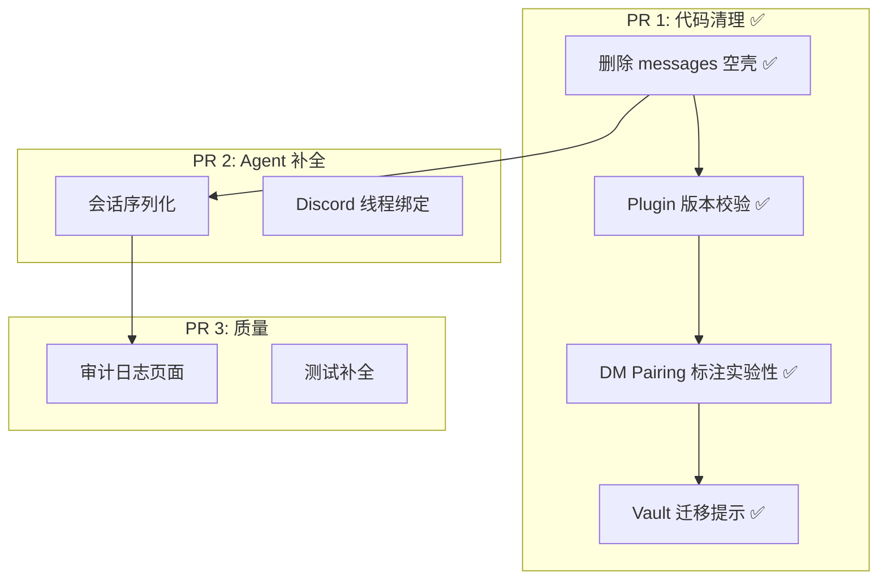

# v0.8.4 代码清理与完善计划

> 基于 v0.8.3 代码审查，提取真正需要动手的改进项。

---

## 一、快速清理 ✅ 已完成

### 1. 删除 messages 空壳路由 ✅

- 删除 `packages/server/src/routes/messages.ts`
- 移除 `app.ts` 中的 import 和 `.route("/messages", messagesRoute)`
- 清理 `docs/DESIGN.md` 中的引用

### 2. Plugin 版本兼容校验 ✅

- `skill-loader.ts` 新增 `satisfiesRange()` 轻量 semver 比较（支持 `>=`/`^`/`~`/精确匹配）
- 正确处理 `^0.x.z` 语义（锁定 minor）
- 从 `package.json` 导入版本号，不兼容时 push warning（不阻断加载）

### 3. DM Pairing 标记为实验性 ✅

- `dm-policy.ts` 注释标明 pairing code 未实现，当前等同 senderId allowlist

### 4. 凭证迁移启动提示 ✅

- `config/store.ts` 新增 `detectPlaintextCredentials()` + `countPlaintext()`
- 启动时扫描配置，检测到明文凭证输出迁移命令提示
- `CREDENTIAL_FIELDS` 常量提取到 `security/vault.ts` 共享，消除 `vault-migrate.ts` 重复定义

---

## 二、Agent 能力补全

### 5. 会话序列化（防并发）

**问题**：同一 session 的多条消息可能并发进入 `agentRuntime.run()`，导致上下文竞争。

**方案**：per-session 串行队列。

```
packages/server/src/agents/session-lane.ts  // 新建

SessionLane {
  private queues: Map<string, Promise<void>>

  async run(sessionKey: string, fn: () => Promise<void>) {
    const prev = this.queues.get(sessionKey) ?? Promise.resolve();
    const next = prev.then(fn, fn);  // 前序失败也继续
    this.queues.set(sessionKey, next);
    await next;
  }
}
```

在 `gateway.ts` 的消息入口处包裹：`sessionLane.run(key, () => agentRuntime.run(...))`。

---

### 6. Discord 线程绑定

**问题**：Discord 频道中的对话混在一起，无法按线程隔离 session。

**方案**：
- Discord 适配器收到消息时，若 `message.channel.isThread()`，用 `threadId` 作为 session key 的一部分
- Agent 首次回复非线程消息时，自动创建 thread 并绑定
- 线程闲置超时后解绑（复用 session idle reset 机制）

**涉及文件**：
- `packages/server/src/channels/discord.ts` — 消息解析时提取 threadId
- `packages/server/src/channels/types.ts` — `InboundMessage` 增加可选 `threadId`
- `packages/server/src/gateway.ts` — session key 生成逻辑

---

## 三、质量提升（按需）

### 7. 审计日志前端页面

API 已有（`routes/audit.ts` 支持按 action/actor/时间范围过滤 + 分页）。缺前端展示。

**方案**：新建 `packages/web/src/pages/AuditLog.tsx`，表格展示 + 筛选器，复用 shadcn/ui Table + Pagination 组件。

### 8. STT & Markdown 测试补全

| 模块 | 测试文件 | 覆盖内容 |
|------|----------|----------|
| STT | `media/stt.test.ts` | transcribe 接口参数校验、错误处理、音频格式 |
| Markdown | `components/markdown.test.ts` | KaTeX 渲染、代码高亮、Mermaid 块识别 |

---

## 执行顺序



| PR | 内容 | 状态 |
|----|------|------|
| PR 1 | 第 1-4 项 | ✅ 已完成 |
| PR 2 | 第 5-6 项 | 待开发 |
| PR 3 | 第 7-8 项 | 待开发 |
