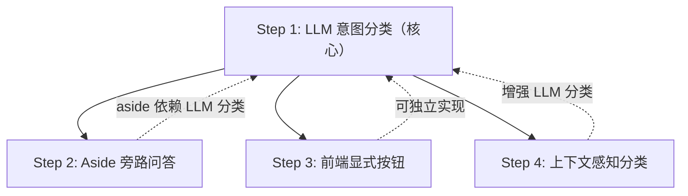

# Steering 机制改进计划

## 问题

当前意图分类使用关键词匹配（`packages/server/src/agents/steering.ts:120-140`），存在明显缺陷：

| 场景 | 期望意图 | 实际结果 | 原因 |
|---|---|---|---|
| "cancel my subscription" | supplement | **cancel** | 误匹配 "cancel" |
| "stop using the old API" | supplement | **cancel** | 误匹配 "stop" |
| "actually, also add tests" | supplement | **redirect** | 误匹配 "actually" |
| "wait, I also need..." | supplement | **redirect** | 误匹配 "wait" |
| "这个不行" | redirect | **supplement** | 没覆盖 |
| "换一种写法" | redirect | **supplement** | 没覆盖 |
| "别写了" | cancel | **supplement** | 没覆盖 |

关键词匹配无法理解语义。"stop using the old API" 是需求描述，不是取消指令。

此外，当前三种意图缺少一个重要场景：**用户想问一个与当前任务无关的快速问题**。参考 Claude Code 的 `/btw` 机制——在 AI 工作期间提问，不中断主任务，不进入对话历史。

---

## 改进方案

### Step 1: LLM 意图分类替换关键词匹配

用轻量 LLM 调用替换 `classifyIntent()`，利用项目已有的 AI SDK (`generateText`)。

**意图扩展为四种**：

| 意图 | 含义 | 行为 |
|---|---|---|
| **cancel** | 放弃当前任务 | abort，清空队列 |
| **redirect** | 换方向 | abort，用新消息重来 |
| **supplement** | 追加要求 | 不打断，完成后接力（默认） |
| **aside** | 与当前任务无关的快速提问 | 不打断，不入队，立即用独立上下文回答 |

**方案设计**：

```typescript
// packages/server/src/agents/steering.ts

export type SteerIntent = "supplement" | "redirect" | "cancel" | "aside" | "none";

async function classifyIntent(
  message: string,
  context?: { currentTask?: string }
): Promise<SteerIntent> {
  // 快速路径：纯标点/emoji/极短消息仍可走规则
  if (isObviousCancel(message)) return "cancel";

  const { text } = await generateText({
    model,  // haiku 级别即可，快+便宜
    maxTokens: 1,
    temperature: 0,
    system: `You classify user messages sent DURING an active AI task.
Output exactly one word: cancel, redirect, supplement, or aside.

- cancel: user wants to stop the current task entirely
- redirect: user wants to change what the task is doing (different approach/target)
- supplement: user wants to add info or a follow-up task (most common)
- aside: user is asking a quick unrelated question (like "what's the port number?" or "that file is called what?")

Current task: ${context?.currentTask ?? "unknown"}`,
    prompt: message,
  });

  const intent = text.trim().toLowerCase();
  if (["cancel", "redirect", "supplement", "aside"].includes(intent)) {
    return intent as SteerIntent;
  }
  return "supplement"; // fallback
}
```

**关键决策**：

| 决策 | 选择 | 理由 |
|---|---|---|
| 模型 | Haiku 级别 | 延迟 <300ms，成本极低，分类任务不需要强推理 |
| maxTokens | 1 | 只需输出一个词 |
| 上下文 | 传入当前任务摘要 | "cancel my subscription" + 上下文"写排序算法" → 显然是 supplement |
| fallback | supplement | 分类失败时最安全的默认值——不中断、不重定向 |
| 快速路径 | 保留极短消息规则 | "算了"、"取消" 这类单独关键词无歧义，跳过 LLM 省延迟 |

**需要改动的文件**：

| 文件 | 改动 |
|---|---|
| `packages/server/src/agents/steering.ts` | `SteerIntent` 增加 `aside`；`classifyIntent` 改为 async + LLM；`steer()` 改为 async |
| `packages/server/src/routes/chat.ts` | `steer()` 加 await；aside 意图处理逻辑 |
| `packages/server/src/routes/ws.ts` | 同上 |
| `packages/server/src/agents/steering.test.ts` | mock LLM 调用，增加语义测试用例 |

**接口变化**：`steer()` 从同步变为 `async`——唯一的 breaking change，调用方只有 chat.ts 和 ws.ts 两处。

---

### Step 2: Aside — 旁路快速问答

借鉴 Claude Code `/btw` 的设计，但适配多通道聊天场景。

**`/btw` 核心特性**（来自 Claude Code 文档）：

- AI 工作期间可用，**不中断主任务**
- 能看到当前完整对话上下文
- **无工具访问**——只从已有上下文回答
- 单轮回答，**不进入对话历史**
- 低成本——复用 prompt cache
- 与 subagent 互补：`/btw` 有上下文无工具，subagent 有工具无上下文

**YanClaw 适配方案**：

```
用户: "这个端口号是多少来着？"
  → classifyIntent → aside
  → 不 abort、不入队
  → 用当前会话上下文 + 用户问题，调用 generateText（无工具）
  → 返回 aside_response 事件（前端显示为临时气泡/overlay）
  → 主任务继续执行，不受影响
```

服务端处理：

```typescript
case "aside":
  // 不中断，不入队
  const answer = await generateText({
    model,
    system: "Answer briefly based on conversation context. No tools available.",
    messages: [...sessionHistory, { role: "user", content: message }],
    maxTokens: 200,
  });
  return { intent: "aside", queued: false, answer: answer.text };
```

前端处理：
- aside 回复显示为**临时浮层/toast**，不插入消息列表
- 自动消失或用户手动关闭
- 不影响 streaming 状态

**需要改动的文件**：

| 文件 | 改动 |
|---|---|
| `packages/server/src/agents/steering.ts` | `steer()` 返回值增加可选 `answer` 字段 |
| `packages/server/src/routes/chat.ts` | aside 分支：读取会话历史，调用 generateText，返回回答 |
| `packages/server/src/routes/ws.ts` | 同上，通过 `chat.aside_response` 事件推送 |
| `packages/web/src/pages/Chat.tsx` | aside 回复渲染为临时浮层组件 |

---

### Step 3: 前端显式意图选择

对于延迟敏感场景，让前端在 UI 层面提供快捷操作，绕过意图分类：

```
┌──────────────────────────────────────────────────────┐
│  AI 正在回复中...                                      │
│                                                      │
│  ┌──────┐  ┌──────┐                                  │
│  │ ■ 停止 │  │ ↻ 重来 │                                │
│  └──────┘  └──────┘                                  │
│                                                      │
│  [输入补充消息...]                       [发送]        │
└──────────────────────────────────────────────────────┘
```

- **停止按钮** → 直接 `POST /api/chat/cancel`，不经过分类
- **重来按钮** → 弹出输入框，带 `intent: "redirect"` 显式传参
- **输入框发送** → 走 `steer` 接口，由 LLM 分类（supplement 或 aside）

cancel 和 redirect 有零延迟的确定性路径，LLM 分类只处理输入框的自然语言消息。

**需要改动的文件**：

| 文件 | 改动 |
|---|---|
| `packages/web/src/pages/Chat.tsx` | streaming 状态下显示停止/重来按钮 |
| `packages/server/src/routes/chat.ts` | `/steer` 接口支持可选 `intent` 参数，跳过分类 |
| `packages/server/src/agents/steering.ts` | `steer()` 接受可选 `intent` 覆盖 |

---

### Step 4: 带上下文的分类

将当前任务摘要传入 `classifyIntent`，提升歧义场景准确度：

```typescript
const currentTask = sessionStore.getLatestUserMessage(sessionKey);
const result = await chatSteering.steer(sessionKey, message, {
  currentTask: currentTask?.content?.slice(0, 200),
});
```

有了上下文，LLM 能区分 "cancel my subscription"（描述需求）和 "cancel"（取消执行）。也能更准确判断 aside——"这个函数在哪个文件？" 在上下文中显然是旁路提问而非追加需求。

---

## 执行顺序



| Step | 优先级 | 依赖 | 核心价值 |
|---|---|---|---|
| 1 | **必做** | 无 | 解决误分类，sync → async |
| 2 | 高 | Step 1 | 新增 aside 意图，提升体验 |
| 3 | 中 | 无（可独立） | cancel/redirect 零延迟确定性路径 |
| 4 | 低 | Step 1 | 解决剩余歧义场景 |

---

## 测试策略

| 层级 | 测试内容 |
|---|---|
| 单元测试 | mock LLM 返回值，验证 steer() 对四种意图的行为 |
| 语义测试 | 真实 LLM 调用测试歧义句子（标记为 integration test） |
| 快速路径 | "算了"、"取消" 等走规则、不调 LLM |
| aside 测试 | 验证 aside 不中断主任务、不入队、返回回答 |
| 延迟基准 | classifyIntent < 500ms (P95) |
| 回退 | LLM 返回非法值 → fallback supplement |
