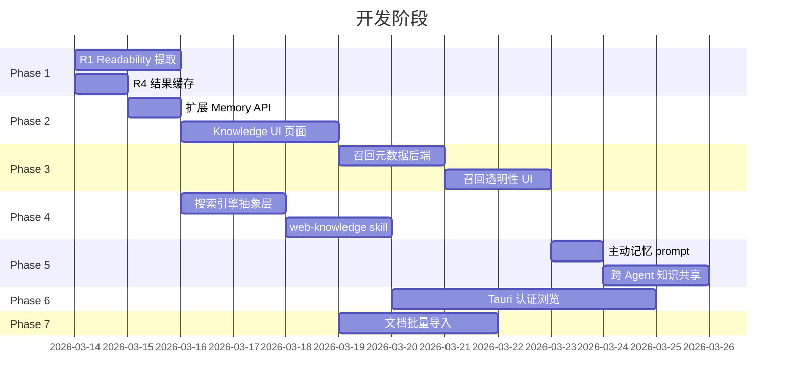

# 网页抓取 + 知识库 + 记忆系统 — 开发计划

> 需求来源：`docs/todos/2026-03-13-web-knowledge-memory.md`
> 目标：在网页获取、知识管理、记忆系统三个维度全面超越 OpenClaw

## 设计原则

1. **统一检索管道**：web_fetch → readability 提取 → 可选自动入库 → 知识召回 → 上下文注入，一条流水线
2. **召回透明性**：用户能看到哪些记忆影响了回复，能修正错误记忆（OpenClaw 做不到）
3. **Tauri 原生优势**：利用桌面 shell 能力替代 Chrome 扩展方案
4. **渐进增强**：每个阶段独立可交付，不阻塞后续

---

## Phase 1 — 网页抓取增强（R1 + R4）

> 前置依赖：无 | 改动范围小，立竿见影

### Step 1.1: web_fetch Readability 提取

**文件：** `packages/server/src/agents/tools/web.ts`

**改动：**
- 新增依赖：`@mozilla/readability` + `linkedom`（轻量 DOM 解析，替代 jsdom）+ `turndown`（HTML→Markdown）
- 在 `createWebFetchTool` 的 execute 函数中：
  1. 现有 fetch + SSRF 防护逻辑不变
  2. 检测 content-type 为 HTML 时，走 readability 管道：
     ```
     HTML → linkedom.parseHTML → Readability.parse → turndown → Markdown
     ```
  3. 返回结构化结果：`{ title, url, content(markdown), excerpt, byline, siteName, length }`
  4. 非 HTML（JSON/XML/纯文本）保持原有逻辑
- 新增配置项 `tools.web.fetch.readability: boolean`（默认 true）
- Fallback：readability 解析失败时降级为原始文本截断

**测试：** 用 3-5 个典型网页（新闻/博客/文档/SPA）验证提取质量

### Step 1.2: 结果缓存层

**文件：** `packages/server/src/agents/tools/web.ts`

**改动：**
- 新增 `WebCache` 类（内存 Map + TTL）：
  ```typescript
  class WebCache {
    private cache = new Map<string, { data: unknown; expires: number }>();
    get(key: string): unknown | undefined;
    set(key: string, data: unknown, ttlMs: number): void;
    clear(): void;
  }
  ```
- web_fetch 和 web_search 执行前先查缓存（key = URL 或 query string）
- 配置项：`tools.web.cache.enabled` (default: true)，`tools.web.cache.ttlMinutes` (default: 15)
- 缓存上限 200 条，LRU 淘汰

**验收标准：** 相同 URL 15 分钟内第二次调用直接返回缓存，日志标注 `[cache hit]`

---

## Phase 2 — 知识库管理 UI（R5）

> 前置依赖：无（后端 API 已有） | 用户感知最强

### Step 2.1: 扩展后端 Memory API

**文件：** `packages/server/src/routes/memory.ts`

**新增端点：**

| 端点 | 功能 | 说明 |
|------|------|------|
| `GET /api/memory/stats` | 统计信息 | 总数、按 agent/source/tags 分布 |
| `DELETE /api/memory/batch` | 批量删除 | body: `{ ids: string[] }` |
| `PATCH /api/memory/batch/tags` | 批量打标签 | body: `{ ids: string[], addTags: string[], removeTags: string[] }` |
| `GET /api/memory/tags` | 标签列表 | 返回所有已使用的标签及计数 |

现有端点增强：
- `GET /api/memory` 增加 `tags` 过滤参数、`source` 过滤、`sortBy` 排序
- `GET /api/memory/search` 增加 `mode` 参数：`keyword` | `semantic` | `hybrid`（默认 hybrid）

### Step 2.2: Knowledge 前端页面

**文件：** `packages/web/src/pages/knowledge.tsx`（新增）

**UI 结构：**

```
┌─────────────────────────────────────────────┐
│ Knowledge                    [搜索框] [导入] │
│ ┌──────┐ ┌──────────────────────────────────┐│
│ │Stats │ │ Filters: [All Tags ▼] [Source ▼] ││
│ │总数   │ │ Mode: [Hybrid] [Keyword] [Vector]││
│ │Agent  │ ├──────────────────────────────────┤│
│ │Source │ │ ☐ Memory #1 — "用户偏好简洁..."  ││
│ │      │ │   tags: [preference] [user]       ││
│ │      │ │   source: tool | 2h ago           ││
│ │      │ │──────────────────────────────────││
│ │      │ │ ☐ Memory #2 — "React 项目..."    ││
│ │      │ │   tags: [fact] [auto-indexed]     ││
│ │      │ │   source: auto | 1d ago           ││
│ └──────┘ └──────────────────────────────────┘│
│                        [< 1 2 3 ... >]       │
└─────────────────────────────────────────────┘
```

**组件：**
- `KnowledgePage` — 主页面，含搜索/过滤/分页
- `MemoryCard` — 单条记忆卡片（摘要、tags、source、时间、操作按钮）
- `MemoryDetail` — 详情弹窗/侧栏（完整内容、编辑、删除）
- `MemoryStats` — 统计侧栏（饼图/数字统计）
- `TagFilter` — 标签多选过滤器

**路由：** 在 `App.tsx` 添加 `/knowledge` 路由，导航栏新增入口

**交互：**
- 搜索框：输入即搜（debounce 300ms），支持关键词和语义搜索切换
- 批量操作：多选后出现底部操作栏（删除/打标签）
- 行内编辑：双击 content 直接编辑
- 标签管理：点击标签快速过滤，长按编辑

---

## Phase 3 — 召回透明性（R8 替代）

> 前置依赖：Phase 2 UI 基础 | YanClaw 独有的差异化功能

### Step 3.1: 后端返回召回元数据

**文件：** `packages/server/src/agents/runtime.ts`

**改动：**
- Memory pre-heat 时（runtime.ts ~line 232），除注入 system prompt 外，同时将召回的记忆 ID + 摘要 + 分数存入 session metadata：
  ```typescript
  interface RecallInfo {
    memoryId: string;
    snippet: string;    // 前 100 字
    score: number;      // 0-1
    source: string;
  }
  ```
- `memory_search` tool 调用结果也记录到 RecallInfo
- 通过 SSE/WebSocket 事件 `recall` 推送给前端：
  ```typescript
  { type: "recall", data: RecallInfo[] }
  ```

### Step 3.2: 前端召回展示

**文件：** `packages/web/src/components/prompt-kit/Message.tsx`（增强）

**UI：**
- Agent 回复消息底部新增可折叠的"参考记忆"区域（类似 citation）
- 展示：记忆摘要 + 相关度分数 + 来源标签
- 点击跳转到 Knowledge 页面对应条目
- 如果记忆有误，用户可直接点"修正"编辑或"忽略"标记

**改动范围：** Message 组件 + 新增 `RecallPanel` 子组件

---

## Phase 4 — 多搜索引擎 + 自动入库（R2 + R6）

> 前置依赖：Phase 1 | 增强信息获取和知识积累

### Step 4.1: 搜索引擎抽象层

**文件：** `packages/server/src/agents/tools/web.ts`（重构为目录）

**结构：**
```
agents/tools/web/
  index.ts          # createWebFetchTool, createWebSearchTool (不变)
  fetch.ts          # web_fetch 实现 + readability
  search.ts         # web_search 多 provider 路由
  cache.ts          # WebCache
  providers/
    duckduckgo.ts   # 现有逻辑抽出
    brave.ts        # Brave Search API
    tavily.ts       # Tavily API（AI 优化搜索，结果质量 > Brave）
```

**Provider 接口：**
```typescript
interface SearchProvider {
  name: string;
  search(query: string, limit: number): Promise<SearchResult[]>;
  isAvailable(): boolean;  // 检查 API Key 是否配置
}
```

- 按配置优先级尝试 provider，失败自动 fallback
- Tavily 替代 Kimi（Tavily 是专为 AI agent 设计的搜索 API，结果结构化更好）
- 默认顺序：Tavily → Brave → DuckDuckGo

**配置（schema.ts）：**
```json5
tools: {
  web: {
    search: {
      providers: ["tavily", "brave", "duckduckgo"],
      tavily: { apiKey: "${TAVILY_API_KEY}" },
      brave: { apiKey: "${BRAVE_API_KEY}" }
    },
    fetch: {
      readability: true,
      cache: { enabled: true, ttlMinutes: 15 }
    }
  }
}
```

### Step 4.2: 网页内容自动入库 Skill

**文件：** 新增 `plugins/web-knowledge/`

```
plugins/web-knowledge/
  skill.json        # SkillManifest
  index.ts          # Plugin 定义
  prompt.md         # Agent prompt 指导
```

**实现：**
- 使用 `afterToolCall` hook 拦截 `web_fetch` 结果
- 提取 title + URL + readability content
- URL 去重（检查 memories 表是否已有相同 URL 的条目）
- 超长内容分块（每块 ≤ 4000 字符，按段落切分）
- 自动生成 embedding 并存入 memories
- 标签：`["web", "auto-stored", domainName]`

**Prompt（prompt.md）：**
- 指导 agent 在研究类任务中主动使用 web_fetch
- 提示已抓取的网页会自动保存到知识库
- 鼓励 agent 用 memory_search 检索已抓取内容，避免重复抓取

---

## Phase 5 — 主动记忆 + 知识共享（R9 + R10）

> 前置依赖：Phase 3 | 让记忆系统更智能

### Step 5.1: 主动记忆 System Prompt

**文件：** `packages/server/src/agents/system-prompt-builder.ts`

**改动：**
- 在 memory 启用时，注入记忆策略 prompt 段（作为 bootstrap 内容的一部分）：

```markdown
## Memory Guidelines

You have persistent memory. Use it proactively:

1. **Store user preferences** when they express likes/dislikes or work style
2. **Store project facts** (tech stack, team members, deadlines, conventions)
3. **Store task outcomes** (what worked, what didn't, key decisions)
4. **Before answering**, search memory for relevant context

Do NOT store: transient conversation details, easily re-derivable info, raw code snippets.
Tag memories consistently: [preference], [fact], [decision], [outcome], [person].
```

- 可通过 agent 级别的 `memory.promptOverride` 自定义

### Step 5.2: 跨 Agent 知识共享

**文件：** `packages/server/src/db/memories.ts` + `config/schema.ts`

**改动：**
- memories 表新增 `scope` 字段：`"private"` | `"shared"`（默认 private）
- `MemoryStore.search()` 增加 `includeShared: boolean` 参数
- 当 `includeShared=true` 时，搜索同时匹配 `agentId=当前agent OR scope=shared`
- `memory_store` tool 新增 `shared` 参数，agent 可选择存入共享知识库
- API 端点 `GET /api/memory` 增加 `scope` 过滤

**配置：**
```json5
agents: [{
  memory: {
    enabled: true,
    sharedAccess: true  // 是否可访问共享知识
  }
}]
```

**迁移：** 现有数据默认 `scope = "private"`，无破坏性变更

---

## Phase 6 — Tauri 认证浏览（R3 替代）

> 前置依赖：Phase 1 | 替代 Chrome 扩展方案，利用 Tauri 原生能力

### Step 6.1: Tauri WebView 认证浏览

**设计思路（替代 Chrome 扩展）：**

```
Tauri App → 打开 WebView 窗口 → 用户登录目标网站
                                    ↓
Agent tool call → Tauri IPC → WebView 执行 JS 获取页面内容 → 返回给 Agent
```

**优势 vs Chrome 扩展：**
- 无需用户安装额外扩展
- Tauri WebView 隔离性更好（独立 cookie jar）
- 可在 Tauri 侧做域名白名单强制控制
- 与 YanClaw 桌面应用深度集成（系统托盘操作/通知）

**文件：**
- `src-tauri/src/browser_relay.rs` — WebView 管理 + IPC handler
- `packages/server/src/agents/tools/browser-relay.ts` — Agent tool 定义
- `packages/web/src/components/BrowserRelay.tsx` — 管理 UI

**新增 Tool：**
- `browser_relay_open(url, label)` — 打开认证浏览器窗口
- `browser_relay_fetch(url)` — 通过已认证窗口获取页面内容
- `browser_relay_list()` — 列出已打开的认证会话

**安全：**
- 域名白名单配置（`tools.browserRelay.allowedDomains`）
- 不暴露 cookie/token 给 agent，仅返回页面内容
- 用户可随时关闭认证窗口（撤销访问）

**工作量：** 大，但比 Chrome 扩展体验更好且安全性更高

---

## Phase 7 — 文档批量导入（R7）

> 前置依赖：Phase 2 UI | 按需实现

### Step 7.1: 导入 API + 前端

**后端（`routes/memory.ts` 新增）：**
- `POST /api/memory/import` — multipart 文件上传
- 支持格式：.md, .txt, .pdf（pdf-parse）, .json, .csv
- 大文件智能分块：
  - Markdown：按 ## 标题切分
  - 纯文本：按段落（双换行）切分，每块 ≤ 4000 字符
  - PDF：按页切分
  - JSON/CSV：按记录切分
- 异步处理：返回 jobId，前端轮询进度
- 批量 embedding 生成（embedMany）

**前端（Knowledge 页面增强）：**
- 拖拽上传区域
- 进度条（已处理 / 总块数）
- 导入完成后自动刷新列表

---

## 交付顺序与依赖关系



## 实施状态

> 更新于 2026-03-13

| Phase | 状态 | 说明 |
|-------|------|------|
| **1** | ✅ 完成 | Readability 提取 + LRU TTL 缓存（200 条，默认 15 分钟） |
| **2** | ✅ 完成 | 后端 6 个新/增强端点 + Knowledge 页面（搜索/过滤/CRUD/统计/批量操作） |
| **3** | ✅ 完成 | 后端 recall 事件 + 前端 RecallPanel 组件 + 深链跳转 Knowledge 详情 |
| **4** | ✅ 完成 | 3 provider（Tavily→Brave→DuckDuckGo）fallback + 内置 web-knowledge 自动入库插件 |
| **5** | ✅ 完成 | 主动记忆 prompt 注入 + scope 字段 + 共享知识可见/可搜索 + agent sharedAccess 配置接入 |
| **6** | 🔜 待定 | Tauri WebView 认证浏览，独立 session 实现 |
| **7** | ✅ 完成 | 文档批量导入（.md/.txt/.json/.csv）+ Knowledge 页面导入 UI + 拖拽上传 |

### 实际文件变更清单

**新增文件：**
- `packages/server/src/agents/tools/web/fetch.ts` — Readability 提取管道
- `packages/server/src/agents/tools/web/cache.ts` — LRU TTL 缓存
- `packages/server/src/agents/tools/web/search.ts` — 多 provider 搜索路由
- `packages/server/src/agents/tools/web/index.ts` — barrel 导出
- `packages/server/src/agents/tools/web/providers/types.ts` — SearchProvider 接口
- `packages/server/src/agents/tools/web/providers/duckduckgo.ts`
- `packages/server/src/agents/tools/web/providers/brave.ts`
- `packages/server/src/agents/tools/web/providers/tavily.ts`
- `packages/server/src/plugins/builtin/web-knowledge.ts` — 自动入库插件
- `packages/web/src/pages/Knowledge.tsx` — 知识库管理页面
- `packages/web/src/components/prompt-kit/recall-panel.tsx` — 召回引用面板
- `packages/server/src/memory/chunker.ts` — 文档分块器（Markdown/Text/JSON/CSV）

**修改文件：**
- `packages/server/src/routes/memory.ts` — 新增 stats/tags/batch/GET/:id/import 端点，增强 list/search
- `packages/server/src/db/schema.ts` — memories 表新增 scope 列
- `packages/server/src/db/sqlite.ts` — 迁移 v7
- `packages/server/src/db/memories.ts` — scope/includeShared 支持
- `packages/server/src/agents/runtime.ts` — recall 事件
- `packages/server/src/agents/system-prompt-builder.ts` — 主动记忆 guidelines
- `packages/server/src/agents/tools/memory.ts` — shared 参数
- `packages/server/src/agents/tools/index.ts` — web 工具导入路径
- `packages/server/src/gateway.ts` — 注册内置插件
- `packages/web/src/pages/Chat.tsx` — recall 事件处理 + RecallPanel 渲染
- `packages/web/src/lib/api.ts` — RecallInfo 类型 + recall 事件
- `packages/web/src/App.tsx` — Knowledge 路由 + 导航
- `packages/web/src/i18n/locales/zh.json` / `en.json` — knowledge 导航 i18n

### 已知待改进项（不阻塞发布）

- web-knowledge 插件硬编码 `agentId: "main"` — afterToolCall hook 无 agent 上下文，已改为 `scope: "shared"` 缓解
- PDF 导入暂未支持 — 需额外依赖，可后续通过 media.extractPdfText + chunker 实现
- 导入大文件时无进度反馈 — 当前同步处理，未来可改为异步 job + SSE 推送进度

## 各阶段验收标准

| Phase | 验收标准 |
|-------|---------|
| **1** | web_fetch 返回 Markdown 格式正文，缓存命中率日志可见 |
| **2** | Knowledge 页面可搜索/浏览/编辑/删除记忆，统计面板显示正确 |
| **3** | Agent 回复下方展示"参考记忆"列表，点击可跳转编辑 |
| **4** | 搜索可 fallback 多引擎，抓取内容自动出现在 Knowledge 页面 |
| **5** | Agent 主动存储用户偏好/事实，多 agent 可共享知识 |
| **6** | 通过 Tauri 窗口登录网站后，agent 可获取认证页面内容 |
| **7** | 拖拽上传文件后自动分块入库，进度可见 |

## 超越 OpenClaw 的关键差异点

| 维度 | OpenClaw | YanClaw（本计划实现后） |
|------|----------|----------------------|
| 召回透明性 | 无 — 用户看不到记忆影响 | ✅ 消息级 citation + 可修正 |
| 认证浏览 | CDP 直连需额外 Chrome profile | ✅ Tauri 原生 WebView，零配置 |
| 搜索引擎 | 5 provider 自动检测 | ✅ 可配置 provider 优先级 + AI 优化搜索（Tavily） |
| 知识管理 UI | 仅配置页 + CLI | ✅ 完整 Knowledge 页面（搜索/过滤/编辑/统计） |
| 自动入库 | 手动 memory_get/memory_search | ✅ web_fetch 自动入库 + 去重 + 分块 |
| 跨 Agent 共享 | 无（agent 隔离） | ✅ shared scope 共享知识库 |
| 内容提取 | readability + Firecrawl | ✅ readability + Markdown 转换（质量对齐） |
| 主动记忆 | 依赖 MEMORY.md 指导 | ✅ 结构化记忆策略 prompt + 自动标签 |
