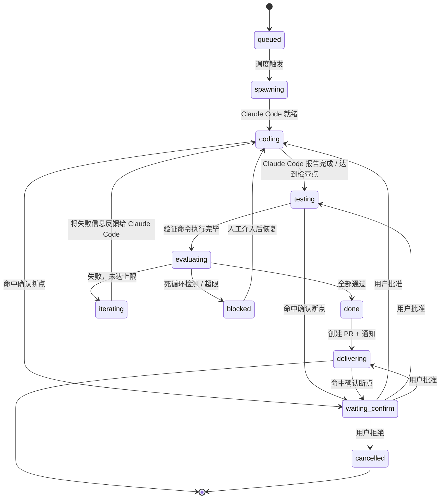

# Dev Loop — 自治开发循环设计

> YanClaw 调用 Claude Code 自动开发项目，24小时监控进展，测试反馈迭代。

## 概述

在现有 Agent Hub（AgentSupervisor）之上新增 **DevLoopController** 编排层，实现：

1. 通过 Dashboard 或 Chat Channel 触发开发任务
2. 全自动执行：编码 → 测试 → 评估 → 迭代循环
3. 全程推送进展到 Channel
4. 用户可配置人工确认断点（按操作类型/阶段/风险等级/任务）
5. 智能终止：死循环检测 + 次数/时间上限
6. 完成后自动创建 PR 并通知
7. DAG 编排多任务依赖调度

## 架构

```
用户(Dashboard/Channel) → DevLoopController → AgentSupervisor → Claude Code
                              ↑                                      ↓
                              ← TestRunner ← IterationJudge ← 事件流 ←┘
```

DevLoopController 层叠加在 AgentSupervisor 之上，复用其 spawn/stop/permission/worktree/DAG 能力。

## §1 核心状态机



### DevTask

```typescript
interface DevTask {
  id: string;
  state: DevTaskState;
  prompt: string;              // 用户的开发指令
  projectPath: string;         // 目标项目路径
  worktreePath?: string;       // git worktree 隔离路径
  processId?: string;          // AgentSupervisor 进程 ID

  // 迭代控制
  iteration: number;           // 当前迭代次数
  maxIterations: number;       // 上限（默认 10）
  maxDurationMs: number;       // 时间上限（默认 4h）
  errorHistory: string[];      // 历史错误，用于死循环检测

  // 验证
  verifyCommands: string[];    // 默认 ["bun test", "bun run check"]
  lastTestResult?: VerifyResult;

  // 确认策略
  confirmPolicy: ConfirmPolicy;

  // 交付
  branch?: string;
  prUrl?: string;

  // 元数据
  triggeredBy: "dashboard" | "channel";
  channelPeer?: Peer;          // 回推通知的目标
  createdAt: number;
  startedAt?: number;
  completedAt?: number;
  dagId?: string;              // 所属 DAG
  dagNodeId?: string;
}

type DevTaskState =
  | "queued"
  | "spawning"
  | "coding"
  | "testing"
  | "evaluating"
  | "iterating"
  | "done"
  | "delivering"
  | "blocked"
  | "waiting_confirm"
  | "cancelled";
```

## §2 确认策略（ConfirmPolicy）

四个维度叠加，任意一个命中就暂停等确认：

```typescript
interface ConfirmPolicy {
  // 按操作类型：命中的工具名暂停
  operations: string[];        // 如 ["shell", "file_write", "git_push"]

  // 按阶段：进入该阶段前暂停
  stages: DevTaskStage[];      // 如 ["coding", "testing", "delivering"]

  // 按风险等级：该等级及以上暂停
  riskThreshold: "low" | "medium" | "high" | "none";  // "none" = 全自动

  // 按任务覆盖：DAG 场景下每个 node 可单独配置
}

type DevTaskStage = "coding" | "testing" | "delivering";
```

**判定优先级：** 任务级覆盖 > operations > stages > riskThreshold

**默认策略：**

```typescript
const DEFAULT_CONFIRM_POLICY: ConfirmPolicy = {
  operations: [],
  stages: ["delivering"],      // 默认只在创建 PR 前确认
  riskThreshold: "none",
};
```

**配置入口：**

- 全局：`config.json5` → `agentHub.devLoop.defaultConfirmPolicy`
- 任务级：spawn 时传入 `confirmPolicy` 覆盖
- Channel：`/dev feature X --confirm-stages=coding,delivering --confirm-risk=high`

## §3 迭代判断器（IterationJudge）

`evaluating` 阶段决定下一步：

```typescript
interface JudgeDecision {
  action: "done" | "iterate" | "blocked";
  reason: string;
  feedbackPrompt?: string;     // iterate 时反馈给 Claude Code
}
```

**判断流程：**

1. 测试全部通过 → `done`
2. 超过 maxIterations 或 maxDurationMs → `blocked(超限)`
3. 最近 3 次错误相同模式 → `blocked(死循环)`
4. 否则 → `iterate`

**死循环检测：** 对 `errorHistory` 最近 3 条提取错误关键行，去除行号/时间戳后比对。连续 3 次相同模式 → 死循环。

**feedbackPrompt 模板：**

```
测试失败（第 {n}/{max} 次迭代）。

失败命令：{command}
错误输出：
{stderr 最后 100 行}

请分析错误原因并修复。注意：
- 之前的修复尝试没有解决问题，请尝试不同的方向
- 如果需要更多上下文，请读取相关文件
```

## §4 TestRunner

```typescript
interface TestResult {
  passed: boolean;
  command: string;
  exitCode: number;
  stdout: string;              // 截断到最后 200 行
  stderr: string;              // 截断到最后 200 行
  durationMs: number;
}

interface VerifyResult {
  allPassed: boolean;
  results: TestResult[];       // 短路执行，第一个失败即停止
}
```

**执行规则：**

- 在 worktreePath（或 projectPath）下依次执行 verifyCommands
- 短路：第一个命令失败就停止
- 每个命令超时 5 分钟（可配置 `testTimeoutMs`）
- 用 `Bun.spawn` 执行，隔离环境变量
- stdout/stderr 截断保留尾部

**默认验证命令自动检测：**

1. 读 `package.json` → `scripts.test` 有则用 `bun test`
2. `scripts.lint` / `scripts.check` 有则追加
3. 都没有 → `bun run build`（至少编译通过）

## §5 触发入口

### Dashboard

扩展 SpawnDialog 新增 "Dev Loop" 模式选项卡：

- 任务描述（prompt）
- 目标项目路径
- 验证命令（可编辑列表，自动检测填充）
- 确认策略（操作类型多选、阶段多选、风险等级下拉）
- 迭代上限 / 时间上限
- worktree 隔离开关

ProcessCard 增加迭代进度指示（`第 3/10 次迭代`、当前阶段 badge）。

### Channel 指令

```
/dev <prompt>                          # 最简形式，全部默认配置
/dev <prompt> --path=/path/to/project
/dev <prompt> --verify="bun test && bun run check"
/dev <prompt> --max-iterations=5
/dev <prompt> --confirm-risk=high
/dev status                            # 查看所有 DevTask 状态
/dev stop <taskId>                     # 停止任务
/dev resume <taskId>                   # 人工介入后恢复
/dev approve <taskId>                  # 批准确认断点
```

在 routing 层注册 `/dev` 前缀命令，转发到 `channel-command.ts`，调用 DevLoopController 同一套 API。

## §6 通知推送

| 阶段变化 | 推送内容 |
|---------|---------|
| `queued → spawning` | 任务已开始：{prompt 前50字} |
| `spawning → coding` | Claude Code 已启动，开始编码 |
| `coding → testing` | 编码完成，开始运行测试 |
| `evaluating → done` | 测试通过（第 {n} 次迭代），准备交付 |
| `evaluating → iterating` | 测试失败（第 {n}/{max} 次），自动重试中。错误摘要：{前3行} |
| `evaluating → blocked` | 任务阻塞：{原因}，需要人工介入。/dev resume {id} |
| `waiting_confirm` | 等待确认：{断点原因}。/dev approve {id} |
| `delivering` | PR 已创建：{prUrl} |

**推送目标：**

- `triggeredBy === "channel"` → 推回触发的 Channel peer
- `triggeredBy === "dashboard"` → 推送到 `agentHub.notifyChannel`
- 两者都配了则都推

**配置：** `agentHub.devLoop.notifyEvents: DevTaskStage[]`（默认全部推送）

## §7 交付流程

任务 `done` 后自动执行：

1. `git add -A && git commit`（在 worktree 中）
2. 生成 branch：`dev-loop/{taskId}-{prompt前20字slugify}`
3. `git push origin {branch}`
4. `gh pr create`
5. 推送 PR URL 到 Channel
6. 保留 worktree，用户 merge 后手动清理

**PR Body 模板：**

```markdown
## Dev Loop 自动提交

**任务**: {prompt}
**迭代次数**: {iteration}
**耗时**: {duration}
**验证命令**: {verifyCommands.join(" && ")}

## 测试结果
全部通过

## 变更文件
{git diff --stat}

---
由 YanClaw Dev Loop 自动创建
```

**DAG 场景：**

- 当前 node 完成 → 标记 DAG node done → 触发下游依赖 node
- 最终 node 完成时创建 PR（中间 node 只 commit 不 PR）
- 可配置为每个 node 独立 PR

## §8 模块结构

```
packages/server/src/agents/dev-loop/
├── controller.ts        # DevLoopController — 主编排器
├── state-machine.ts     # 状态机定义与转换逻辑
├── test-runner.ts       # TestRunner — 执行验证命令
├── iteration-judge.ts   # IterationJudge — 死循环检测 + 迭代决策
├── confirm-gate.ts      # ConfirmationGate — 断点拦截与恢复
├── deliverer.ts         # Deliverer — git commit/push/PR
├── channel-command.ts   # /dev 命令解析器
└── types.ts             # 所有类型定义
```

**集成点：**

| 集成点 | 方式 |
|-------|------|
| AgentSupervisor | DevLoopController 持有引用，调用 spawn/send/stop，监听事件流 |
| ConfirmPolicy ↔ Permission | Claude Code 的 permission_request 经 ConfirmationGate 判定 |
| Notifier | 复用现有 notifier，DevLoopController 发射事件 |
| DAG | 复用现有 TaskDAG，DevTask 作为 DAG node 执行载体 |
| Routes | 新增 `routes/dev-loop.ts` → `/api/dev-loop/*` |
| Channel | routing 层注册 `/dev` 前缀命令 |
| Config | `agentHub.devLoop` 新增配置块 |
| Dashboard | 扩展 SpawnDialog + ProcessCard |

**Gateway 初始化：**

```typescript
const devLoop = new DevLoopController({ supervisor, notifier, config });
ctx.devLoop = devLoop;
```

## 配置 Schema

```typescript
agentHub: {
  // ... 现有字段
  devLoop: {
    enabled: z.boolean().default(false),
    defaultConfirmPolicy: ConfirmPolicySchema.default(DEFAULT_CONFIRM_POLICY),
    maxIterations: z.number().default(10),
    maxDurationMs: z.number().default(4 * 60 * 60 * 1000), // 4h
    testTimeoutMs: z.number().default(5 * 60 * 1000),       // 5min per command
    notifyEvents: z.array(z.string()).default([]),           // 空 = 全部
  }
}
```
