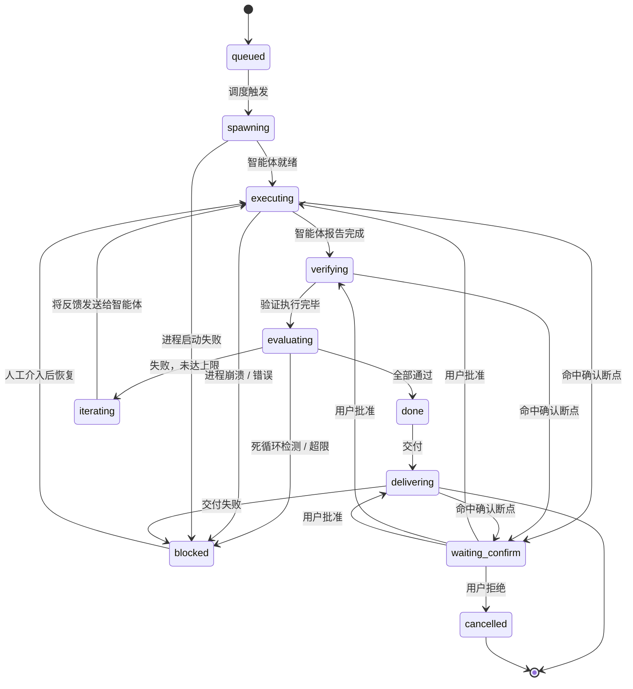

# Task Loop — 自治任务循环设计

> YanClaw 作为个人 AI 协调器，调度智能体执行任务，监控进展，验证结果，反馈迭代。首个场景：Dev Loop（编码）。

## 需求本质

### 第一层：替代人类坐在 AI 工具前面

人类使用 Claude Code 的完整循环：给任务 → 看它写 → 遇到权限请求点批准 → 写完了跑测试 → 测试挂了把错误贴回去说"修" → 循环 → 最终 PR。Task Loop 模拟的就是这个最机械的部分：

| 人类动作 | 程序替代 |
|---------|---------|
| 看着输出等完成 | 监听 `status-change` 事件 |
| 遇到弹窗点允许 | ConfirmPolicy 规则引擎 |
| 跑 `bun test` | Verifier |
| 看报错，复制粘贴给 Claude | FeedbackFormatter |
| 判断"这修不好了，换个思路" | TerminationPolicy（死循环检测）|
| 判断"行了，够了" | TerminationPolicy（迭代上限）|
| 最后 `git push` 开 PR | Deliverer |

核心逻辑本质上是一个 while 循环：

```typescript
while (iteration < max && !deadLoop) {
  agent.send(prompt);
  await agent.done();
  result = verifier.verify();
  if (result.passed) break;
  prompt = feedbackFormatter(result);
  iteration++;
}
deliverer.deliver();
```

### 第二层：YanClaw 是个人 AI 协调器

Claude Code 只是 YanClaw 能调度的智能体之一。更本质地看，YanClaw 的定位是**个人 AI 助理的中枢神经**——它不直接干活，而是协调不同的 AI 工具去干活，监控它们，处理它们的反馈，判断结果，决定下一步。

```
                        YanClaw（协调器）
                       /       |        \
              Claude Code    Codex     Gemini     ...更多智能体
              (写代码)      (写代码)   (写代码)
                  |            |          |
              测试验证      测试验证    测试验证     ...更多验证方式
```

这个模式可以泛化到编码之外：

| 场景 | 智能体 | 验证方式 | 交付物 |
|------|-------|---------|-------|
| 写代码 | Claude Code / Codex / Gemini | 跑测试 | PR |
| 写文档 | Claude API | 检查格式/链接/拼写 | commit |
| 数据分析 | Code Interpreter | 检查输出完整性 | 报告文件 |
| 图片生成 | DALL-E / Midjourney | 人工确认 | 媒体文件 |
| 研究调研 | Perplexity / Web Search Agent | 检查引用有效性 | 文档 |

因此设计分两层：**通用 Task Loop 框架** + **场景预设（Preset）**。

## 概述

在现有 Agent Hub（AgentSupervisor）之上新增 **TaskLoopController** 编排层：

1. 通用循环框架：派发 → 监控 → 验证 → 反馈 → 迭代
2. 可插拔策略：Verifier、Deliverer、FeedbackFormatter、TerminationPolicy
3. 通过 Dashboard 或 Chat Channel 触发
4. 全程推送进展到 Channel
5. 用户可配置人工确认断点
6. DAG 编排多任务依赖调度

首个预设 **Dev Preset**：编码场景（TestRunner 验证 + Git PR 交付）。

## 架构

```
用户(Dashboard/Channel) → TaskLoopController → AgentSupervisor → 智能体
                              ↑                                      ↓
                              ← Verifier ← TerminationPolicy ← 事件流 ←┘
```

### 通用接口

```typescript
// ── 核心循环的可插拔策略 ──

/** 验证器：判断智能体的产出是否合格 */
interface Verifier<TResult = VerifyResult> {
  /** 执行验证，返回结果 */
  verify(ctx: VerifyContext): Promise<TResult>;
  /** 从结果判断是否通过 */
  passed(result: TResult): boolean;
}

interface VerifyContext {
  workDir: string;             // 工作目录（worktree 或 projectPath）
  task: LoopTask;
}

/** 交付器：任务完成后的交付动作 */
interface Deliverer<TResult = VerifyResult> {
  deliver(ctx: DeliverContext<TResult>): Promise<DeliverResult>;
}

interface DeliverContext<TResult> {
  workDir: string;
  task: LoopTask;
  lastResult: TResult;
}

interface DeliverResult {
  success: boolean;
  url?: string;                // PR URL、文件链接等
  error?: string;
}

/** 反馈格式化器：将验证结果转换为给智能体的提示 */
type FeedbackFormatter<TResult = VerifyResult> = (
  result: TResult,
  task: LoopTask,
) => string;

/** 终止策略：决定继续迭代、完成、还是阻塞 */
interface TerminationPolicy {
  judge(ctx: TerminationContext): JudgeDecision;
}

interface TerminationContext {
  task: LoopTask;
  lastResult: unknown;
  elapsed: number;
}

interface JudgeDecision {
  action: "done" | "iterate" | "blocked";
  reason: string;
  feedbackPrompt?: string;
}

/** 场景预设：打包一组策略 */
interface LoopPreset<TResult = VerifyResult> {
  name: string;                // "dev", "docs", "research", ...
  verifier: Verifier<TResult>;
  deliverer: Deliverer<TResult>;
  feedbackFormatter: FeedbackFormatter<TResult>;
  terminationPolicy: TerminationPolicy;
  /** 从用户输入构造预设专用的任务字段 */
  parseOptions?(raw: Record<string, unknown>): Record<string, unknown>;
}
```

### 智能体交互模型

Claude Code SDK 的 `query()` 完成后进程变为 idle（`alive = false`）。TaskLoopController 采用 **session resume** 模式交互：

1. **首次执行**：通过 `supervisor.spawn()` 创建进程，SDK `query()` 执行用户 prompt
2. **执行完成**：监听 supervisor 的 `status-change` 事件（`status: "idle"`），或 `process-stopped` 事件（`reason: "completed"`）
3. **迭代反馈**：通过 `supervisor.resume(processId, feedbackPrompt)` 发送反馈（新方法，见下）
4. **sessionId 追踪**：LoopTask 记录 `sessionId`，每次 resume 时传递以保持会话连续性
5. **进程崩溃**：监听 `process-stopped` 事件（`reason: "error"`），转 `blocked` 状态

**需要新增 `supervisor.resume()` 方法**：现有 `supervisor.send()` 会拒绝 `alive === false` 的进程。新增 `resume(processId, message)` 方法，跳过 alive 检查，直接调用 adapter 的 `send()` 并将进程状态重置为 `running`。ClaudeCodeAdapter 的 `send()` 已支持 `resumeSessionId` 机制。

**防止 stale eviction**：TaskLoop 管理的进程在 `idle` 状态时，supervisor 的 stale check（30 分钟 TTL）可能误删进程记录。TaskLoopController 在进程 idle 后应立即决定下一步（验证 → 评估 → 迭代/完成），如果需要等待（如 `waiting_confirm`），应定期 touch 进程的 `stoppedAt` 时间戳防止被回收。

## §1 核心状态机



### LoopTask

```typescript
interface LoopTask {
  id: string;
  preset: string;              // "dev" | "docs" | "research" | ...
  state: LoopTaskState;
  previousState?: LoopTaskState; // waiting_confirm 恢复时回到哪个状态
  prompt: string;              // 用户指令
  workDir: string;             // 工作目录
  worktreePath?: string;       // git worktree 隔离路径（dev preset 用）
  processId?: string;          // AgentSupervisor 进程 ID
  sessionId?: string;          // 智能体 session ID，用于 resume

  // 迭代控制
  iteration: number;
  maxIterations: number;       // 默认 10
  maxDurationMs: number;       // 默认 4h
  errorHistory: string[];      // 历史错误，用于死循环检测

  // 验证结果（泛型存储，由 preset 解释）
  lastResult?: unknown;

  // 确认策略
  confirmPolicy: ConfirmPolicy;

  // 交付结果
  deliverResult?: DeliverResult;

  // 预设专用字段（由 preset.parseOptions 填充）
  options: Record<string, unknown>;

  // 元数据
  triggeredBy: "dashboard" | "channel";
  channelPeer?: Peer;
  createdAt: number;
  startedAt?: number;
  completedAt?: number;
  dagId?: string;              // TaskLoop 专用 DAG
  dagNodeId?: string;
}

type LoopTaskState =
  | "queued"
  | "spawning"
  | "executing"
  | "verifying"
  | "evaluating"
  | "iterating"
  | "done"
  | "delivering"
  | "blocked"
  | "waiting_confirm"
  | "cancelled";
```

## §2 确认策略（ConfirmPolicy）

四个维度叠加，任意一个命中就暂停等确认：

```typescript
interface ConfirmPolicy {
  // 按操作类型：命中的工具名暂停
  operations: string[];        // 如 ["shell", "file_write", "git_push"]

  // 按阶段：进入该阶段前暂停
  stages: LoopStage[];         // 如 ["executing", "verifying", "delivering"]

  // 按风险等级：该等级及以上暂停
  riskThreshold: "low" | "medium" | "high" | "none";  // "none" = 全自动

  // 按任务覆盖：DAG 场景下每个 node 可单独配置
}

type LoopStage = "executing" | "verifying" | "delivering";
```

**判定优先级：** 任务级覆盖 > operations > stages > riskThreshold

**默认策略：**

```typescript
const DEFAULT_CONFIRM_POLICY: ConfirmPolicy = {
  operations: [],
  stages: ["delivering"],      // 默认只在交付前确认
  riskThreshold: "none",
};
```

**配置入口：**

- 全局：`config.json5` → `agentHub.taskLoop.defaultConfirmPolicy`
- 任务级：spawn 时传入 `confirmPolicy` 覆盖
- Channel：`/task dev feature X --confirm-stages=executing,delivering --confirm-risk=high`

## §3 终止策略（TerminationPolicy）

### 默认实现：DefaultTerminationPolicy

```typescript
interface TerminationContext {
  task: LoopTask;
  lastResult: unknown;         // Verifier 返回的结果
  elapsed: number;             // 已耗时 ms
}

interface JudgeDecision {
  action: "done" | "iterate" | "blocked";
  reason: string;
  feedbackPrompt?: string;     // iterate 时反馈给智能体
}
```

**判断流程：**

1. `verifier.passed(lastResult)` → `done`
2. 超过 `maxIterations` 或 `maxDurationMs` → `blocked(超限)`
3. 最近 3 次错误相同模式 → `blocked(死循环)`
4. 否则 → `iterate`

**死循环检测：** 对 `errorHistory` 最近 3 条提取错误关键行，去除行号/时间戳后比对。连续 3 次相同模式 → 死循环。

预设可提供自定义 TerminationPolicy 覆盖默认行为。

## §4 Dev Preset（编码场景）

首个预设，提供编码场景的完整策略实现。

### DevVerifier（验证器）

执行 shell 验证命令，即之前的 TestRunner：

```typescript
// Dev preset 专用选项（存储在 task.options 中）
interface DevOptions {
  verifyCommands: string[];    // 默认 ["bun test", "bun run check"]
  testTimeoutMs: number;       // 默认 5min
  testSandbox: "none" | "docker";
}

// 验证结果
interface DevVerifyResult {
  allPassed: boolean;
  results: CommandResult[];    // 短路执行，第一个失败即停止
}

interface CommandResult {
  passed: boolean;
  command: string;
  exitCode: number;
  stdout: string;              // 截断到最后 200 行
  stderr: string;              // 截断到最后 200 行
  durationMs: number;
}
```

**执行规则：**

- 在 workDir 下依次执行 verifyCommands
- 短路：第一个命令失败就停止
- 每个命令超时由 `testTimeoutMs` 控制
- 用 `Bun.spawn` 执行，环境变量继承父进程但剥离敏感变量（`*_KEY`, `*_SECRET`, `*_TOKEN`, `*_PASSWORD`）
- 可选配置 `testSandbox: "docker"` 使用 Docker 容器隔离（复用现有 `tools.exec.sandbox` 能力）
- stdout/stderr 截断保留尾部

**默认验证命令自动检测：**

1. 读 `package.json` → `scripts.test` 有则用 `bun test`
2. `scripts.lint` / `scripts.check` 有则追加
3. 都没有 → `bun run build`（至少编译通过）

### DevFeedbackFormatter（反馈格式化器）

```
测试失败（第 {n}/{max} 次迭代）。

失败命令：{command}
错误输出：
{stderr 最后 100 行}

请分析错误原因并修复。注意：
- 之前的修复尝试没有解决问题，请尝试不同的方向
- 如果需要更多上下文，请读取相关文件
```

### DevDeliverer（交付器）

任务 `done` 后自动执行：

1. 运行 LeakDetector 扫描 worktree diff，检测 secrets/credentials
2. `git add -u`（仅已跟踪文件）+ `git add` 新增的源码文件（排除 `.env*`, `*.key`, `*.pem`, `node_modules/`）
3. `git commit`（在 worktree 中）
4. 生成 branch：`task-loop/{taskId}-{prompt前20字slugify}`
5. `git push origin {branch}`（失败则重试 1 次，仍失败 → 返回 `success: false`）
6. `gh pr create`（失败 → 返回 `success: false`）
7. 返回 `{ success: true, url: prUrl }`

**交付失败处理**：`deliver()` 返回 `success: false` → TaskLoopController 转 `blocked`，推送错误详情到 Channel。

**PR Body 模板：**

```markdown
## Task Loop 自动提交

**任务**: {prompt}
**迭代次数**: {iteration}
**耗时**: {duration}
**验证命令**: {verifyCommands.join(" && ")}

## 测试结果
全部通过

## 变更文件
{git diff --stat}

---
由 YanClaw Task Loop 自动创建
```

## §5 触发入口

### Dashboard

扩展 SpawnDialog 新增 "Task Loop" 模式选项卡：

- 预设选择（Dev / 未来更多）
- 任务描述（prompt）
- 工作目录（默认当前项目）
- 预设专用配置（Dev: 验证命令、worktree 开关）
- 确认策略（操作类型多选、阶段多选、风险等级下拉）
- 迭代上限 / 时间上限

ProcessCard 增加迭代进度指示（`第 3/10 次迭代`、当前阶段 badge）。

### Channel 指令

```
/task <preset> <prompt>                     # 如 /task dev "实现用户登录"
/task dev <prompt> --path=/path/to/project
/task dev <prompt> --verify="bun test && bun run check"
/task dev <prompt> --max-iterations=5
/task dev <prompt> --confirm-risk=high
/task status                                # 查看所有 LoopTask 状态
/task stop <taskId>
/task resume <taskId>                       # 人工介入后恢复
/task approve <taskId>                      # 批准确认断点
```

在 routing 层注册 `/task` 前缀命令，转发到 `channel-command.ts`，调用 TaskLoopController 同一套 API。

## §6 通知推送

| 阶段变化 | 推送内容 |
|---------|---------|
| `queued → spawning` | 任务已开始：{prompt 前50字} |
| `spawning → executing` | 智能体已启动，开始执行 |
| `executing → verifying` | 执行完成，开始验证 |
| `evaluating → done` | 验证通过（第 {n} 次迭代），准备交付 |
| `evaluating → iterating` | 验证失败（第 {n}/{max} 次），自动重试中。摘要：{前3行} |
| `evaluating → blocked` | 任务阻塞：{原因}，需要人工介入。/task resume {id} |
| `waiting_confirm` | 等待确认：{断点原因}。/task approve {id} |
| `delivering` | 交付完成：{deliverResult.url} |

**推送目标：**

- `triggeredBy === "channel"` → 推回触发的 Channel peer
- `triggeredBy === "dashboard"` → 推送到 `agentHub.notifyChannel`
- 两者都配了则都推

**配置：** `agentHub.taskLoop.notifyEvents`（`null` = 全部推送，`[]` = 不推送，指定数组 = 仅推送列出的阶段）

## §7 DAG 编排

TaskLoopController 维护独立的 **TaskLoop DAG**（与 supervisor 的 TaskDAG 分离），避免状态模型冲突：

- supervisor DAG node 状态为 `pending/running/completed/failed/skipped`
- TaskLoop DAG node 状态为完整的 LoopTaskState（含迭代循环）
- TaskLoopController 为每个 DAG node 创建独立的 supervisor 进程，但不使用 supervisor 的 DAG 调度
- 依赖管理和拓扑排序由 TaskLoopController 自行实现（逻辑可复用 supervisor 的 `topologicalSort`）

流程：
- 当前 node 完成（LoopTask 状态 = `done`）→ TaskLoopController 标记 node 完成 → 触发下游依赖 node
- 最终 node 完成时交付（中间 node 仅标记完成）
- 可配置为每个 node 独立交付

DAG 中不同 node 可以使用不同的 preset（如前置研究用 research preset，后续编码用 dev preset）。

## §8 模块结构

```
packages/server/src/agents/task-loop/
├── controller.ts        # TaskLoopController — 主编排器（通用）
├── state-machine.ts     # 状态机定义与转换逻辑（通用）
├── confirm-gate.ts      # ConfirmationGate — 断点拦截与恢复（通用）
├── types.ts             # LoopTask, ConfirmPolicy, 接口定义（通用）
├── default-termination.ts # DefaultTerminationPolicy（通用）
└── presets/
    └── dev/
        ├── index.ts         # DevPreset — 导出 LoopPreset 实例
        ├── verifier.ts      # DevVerifier — shell 命令验证
        ├── deliverer.ts     # DevDeliverer — git commit/push/PR
        └── feedback.ts      # DevFeedbackFormatter
```

通用模块（controller、state-machine、confirm-gate、types、default-termination）不引用任何预设。预设通过 `LoopPreset` 接口注册到 controller。

**集成点：**

| 集成点 | 方式 |
|-------|------|
| AgentSupervisor | TaskLoopController 持有引用，调用 spawn/resume/stop，监听事件流 |
| ConfirmPolicy ↔ Permission | 智能体的 permission_request 经 ConfirmationGate 判定 |
| Notifier | 复用现有 notifier，TaskLoopController 发射事件 |
| DAG | TaskLoopController 维护独立 DAG，仅在全部 node 完成后才通知 supervisor |
| Routes | 新增 `routes/task-loop.ts` → `/api/task-loop/*` |
| Channel | routing 层注册 `/task` 前缀命令 |
| Config | `agentHub.taskLoop` 新增配置块 |
| Dashboard | 扩展 SpawnDialog + ProcessCard |

**Gateway 初始化：**

```typescript
// gateway.ts — GatewayContext 接口新增可选字段
interface GatewayContext {
  // ... 现有字段
  taskLoop?: TaskLoopController;  // 仅 taskLoop.enabled 时创建
}

// initGateway() 中，在 supervisor 创建之后：
if (hubCfg.taskLoop?.enabled) {
  const taskLoop = new TaskLoopController({
    supervisor,
    notifier: agentHubNotifier ?? null,  // notifier 可为 null，此时仅 SSE 推送
    config,
  });
  // 注册预设
  taskLoop.registerPreset(DevPreset);
  ctx.taskLoop = taskLoop;
}
```

## 配置 Schema

```typescript
// config/schema.ts 新增

const ConfirmPolicySchema = z.object({
  operations: z.array(z.string()).default([]),
  stages: z.array(z.enum(["executing", "verifying", "delivering"])).default(["delivering"]),
  riskThreshold: z.enum(["low", "medium", "high", "none"]).default("none"),
});

const TaskLoopSchema = z.object({
  enabled: z.boolean().default(false),
  defaultConfirmPolicy: ConfirmPolicySchema.default({}),
  maxIterations: z.number().min(1).max(50).default(10),
  maxDurationMs: z.number().default(4 * 60 * 60 * 1000),   // 4h
  notifyEvents: z.array(z.enum([
    "spawning", "executing", "verifying", "iterating", "blocked",
    "waiting_confirm", "done", "delivering", "cancelled",
  ])).nullable().default(null),  // null = 全部推送，[] = 不推送
  // 预设专用配置
  presets: z.object({
    dev: z.object({
      testTimeoutMs: z.number().default(5 * 60 * 1000),       // 5min per command
      testSandbox: z.enum(["none", "docker"]).default("none"),
    }).default({}),
  }).default({}),
});

// agentHub schema 新增：
agentHub: z.object({
  // ... 现有字段保持不变
  taskLoop: TaskLoopSchema.default({}),
})
```
