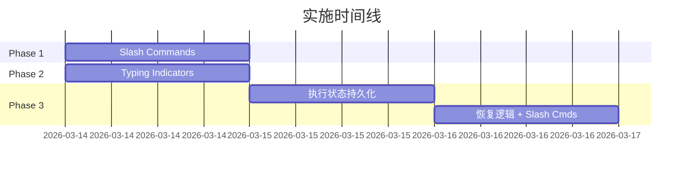

# OpenClaw 启发的改进实现方案

> 基于 `docs/todos/2026-03-14-openclaw-new-insights.md` 需求文档，结合代码库现状制定实施方案。

## 需求文档 Review 结论

需求文档中部分功能**已有实现**，无需重复开发：

| 需求项 | 现状 | 结论 |
|--------|------|------|
| 会话自动重置 | `SessionStore.resetIdle()` + config `session.autoReset` ✅ | 已完成 |
| Session 模型切换 | `session.modelOverride` + runtime 支持 ✅ | 已完成 |
| Bootstrap 文件注入 | config `agents[].bootstrap.mode/files/maxFileChars` ✅ | 已完成 |
| Heartbeat 心跳 | `HeartbeatRunner` 完整实现 ✅ | 已完成 |
| Token 用量追踪 | `UsageTracker` 在 GatewayContext ✅ | 已完成 |
| 会话序列化防并发 | `AgentRuntime.sessionLanes` Map ✅ | 已完成 |

**真正需要新增的功能：** Slash Commands、Typing Indicators、Resumable Sessions。

**评估后不做的功能：**

| 需求项 | 不做理由 |
|--------|---------|
| ContextEngine 插件化 | 现有 `compaction.ts` 实现已完整（LLM 摘要 + 记忆冲刷 + identifier 保留），抽象为插件接口属于过度工程化——目前没有第二种上下文策略的实际需求 |
| Provider 插件化 | `ModelManager` 的 prefix 匹配 + switch-case 已覆盖 5 种 provider，新增 provider 只需加一个 case 分支，引入 registry 抽象增加复杂度但无实际收益 |

---

## 实施计划

### Phase 1: Slash Commands（0.5 天）

**目标：** 在渠道消息流中拦截 `/` 命令，零 token 消耗执行即时操作。

**切入点：** `packages/server/src/channels/manager.ts:175` 已有 `/approve`、`/deny` 拦截逻辑，新增命令遵循相同模式。

#### 1.1 新增文件

```
packages/server/src/channels/slash-commands.ts
```

```typescript
import type { Config } from "../config/schema";
import type { SessionStore } from "../db/sessions";

export interface SlashCommandContext {
  config: Config;
  sessions: SessionStore;
  sessionKey: string;     // 当前会话 key（需从路由解析）
  isOwner: boolean;
}

export interface SlashCommandResult {
  reply: string;
  /** true = 消息已处理完毕，不再传递给 agent */
  handled: boolean;
}

type CommandHandler = (
  args: string,
  ctx: SlashCommandContext,
) => SlashCommandResult | Promise<SlashCommandResult>;

const commands: Record<string, CommandHandler> = {
  "/model": async (args, ctx) => {
    // 切换当前会话模型
    if (!args.trim()) {
      const current = /* 读取 session.modelOverride */ "default";
      return { reply: `Current model: ${current}`, handled: true };
    }
    await ctx.sessions.setModelOverride(ctx.sessionKey, args.trim());
    return { reply: `Model switched to: ${args.trim()}`, handled: true };
  },

  "/reset": async (_, ctx) => {
    await ctx.sessions.clearMessages(ctx.sessionKey);
    return { reply: "Session context cleared.", handled: true };
  },

  "/status": async (_, ctx) => {
    const session = await ctx.sessions.get(ctx.sessionKey);
    if (!session) return { reply: "No active session.", handled: true };
    return {
      reply: `Messages: ${session.messageCount} | Tokens: ~${session.tokenCount}`,
      handled: true,
    };
  },

  "/help": (_, _ctx) => ({
    reply: [
      "/model <id> — switch model for this session",
      "/reset — clear conversation context",
      "/status — show session stats",
      "/help — list commands",
    ].join("\n"),
    handled: true,
  }),
};

/** Parse and execute slash command. Returns null if not a command. */
export function parseSlashCommand(text: string): { name: string; args: string } | null {
  const match = text.match(/^\/(\w+)\s*(.*)/s);
  if (!match || !((`/${match[1]}`) in commands)) return null;
  return { name: `/${match[1]}`, args: match[2] };
}

export async function executeSlashCommand(
  name: string,
  args: string,
  ctx: SlashCommandContext,
): Promise<SlashCommandResult> {
  const handler = commands[name];
  if (!handler) return { reply: `Unknown command: ${name}`, handled: true };
  return handler(args, ctx);
}
```

#### 1.2 修改 `manager.ts`

在 `handleInbound()` 中，approval 命令拦截之后、plugin hooks 之前插入：

```typescript
// 0.3. Slash commands
const parsed = parseSlashCommand(msg.text);
if (parsed) {
  const sessionKey = resolveSessionKey(msg, config); // 复用路由逻辑
  const ctx = { config, sessions: this.sessions, sessionKey, isOwner: isOwnerSender(msg, config) };
  const result = await executeSlashCommand(parsed.name, parsed.args, ctx);
  if (result.handled) {
    const adapter = this.findAdapter(msg.channel, msg.accountId);
    if (adapter) await adapter.send(msg.peer, { text: result.reply, format: "plain" });
    return;
  }
}
```

#### 1.3 测试要点

- `/help` 返回命令列表
- `/model gpt-4o` 更新 session modelOverride
- `/reset` 清空消息但保留 session 元数据
- `/unknowncmd` 不拦截，正常传递给 agent
- 非 owner 执行受限命令被拒绝（如需要的话）

---

### Phase 2: Typing Indicators（0.5 天）

**目标：** Agent 处理消息时在聊天平台显示"正在输入"状态。

#### 2.1 扩展 ChannelAdapter 接口

```typescript
// packages/server/src/channels/types.ts
export interface ChannelAdapter {
  // ... existing ...
  /** Send typing indicator. Optional — not all platforms support it. */
  sendTyping?(peer: Peer): Promise<void>;
}
```

#### 2.2 各适配器实现

**Telegram** (`telegram.ts`):
```typescript
async sendTyping(peer: Peer): Promise<void> {
  await this.bot.api.sendChatAction(peer.id, "typing");
}
```

**Discord** (`discord.ts`):
```typescript
async sendTyping(peer: Peer): Promise<void> {
  const channel = await this.client.channels.fetch(peer.id);
  if (channel?.isTextBased() && "sendTyping" in channel) {
    await (channel as TextChannel).sendTyping();
  }
}
```

**Slack**: 无原生 typing API，跳过实现。

#### 2.3 ChannelManager 中的调度

在 `handleInbound()` 中，agent 执行开始时启动 typing 循环，结束时清除：

```typescript
// 在 agentRunner 调用前
const adapter = this.findAdapter(msg.channel, msg.accountId);
let typingTimer: ReturnType<typeof setInterval> | null = null;

if (adapter?.sendTyping) {
  // 立即发送一次，然后每 5s 刷新（Telegram 6s 超时，Discord 10s 超时）
  adapter.sendTyping(msg.peer).catch(() => {});
  typingTimer = setInterval(() => {
    adapter.sendTyping!(msg.peer).catch(() => {});
  }, 5000);
}

try {
  // ... 现有 agent 执行逻辑 ...
} finally {
  if (typingTimer) clearInterval(typingTimer);
}
```

**群聊策略：** 只在被 @ 或 DM 时发送 typing。在 `handleInbound()` 中已有 peer.kind 判断，复用：

```typescript
const shouldType = msg.peer.kind === "direct" || msg.text.includes(`@${botName}`);
```

#### 2.4 测试要点

- Telegram DM：收到消息后立即显示"typing..."，回复后消失
- Discord 群聊：被 @ 时显示 typing，未被 @ 时不显示
- Slack：不调用 sendTyping，无副作用
- typing 定时器在 agent 报错时也能正确清除

---

### ~~Phase 3: ContextEngine 插件化~~ — 取消

> **取消理由：** 现有 `compaction.ts` 实现已完整（LLM 摘要 + 记忆冲刷 + identifier 保留），抽象为插件接口属于过度工程化。目前没有第二种上下文策略的实际需求，新增接口层只增加复杂度。

### ~~Phase 4: Provider 插件化~~ — 取消

> **取消理由：** `ModelManager` 的 prefix 匹配 + switch-case 已覆盖 5 种 provider（anthropic/openai/google/ollama/openai-compatible），新增 provider 只需加一个 case 分支。引入 registry 抽象无实际收益。

---

### Phase 3: Resumable Sessions（2 天）

**目标：** Agent 执行中断后（服务重启、超时）可恢复。

#### 5.1 执行状态持久化

新增 DB 表记录进行中的 agent 执行状态：

```typescript
// packages/server/src/db/schema.ts 新增
const agentExecutions = sqliteTable("agent_executions", {
  id: text("id").primaryKey(),           // nanoid
  sessionKey: text("session_key").notNull(),
  agentId: text("agent_id").notNull(),
  status: text("status").notNull(),       // "running" | "interrupted" | "completed"
  /** 用户原始消息 */
  userMessage: text("user_message").notNull(),
  /** 已完成的 tool calls（JSON） */
  completedSteps: text("completed_steps"),
  /** 中断时的部分响应 */
  partialResponse: text("partial_response"),
  startedAt: integer("started_at").notNull(),
  updatedAt: integer("updated_at").notNull(),
});
```

#### 5.2 runtime.ts 中的状态追踪

在 agent loop 的每个 step 完成后更新执行状态：

```typescript
// AgentRuntime.run() 中
const executionId = nanoid();
await this.executions.create({ id: executionId, sessionKey, agentId, status: "running", userMessage });

for (const step of agentLoop) {
  // ... 执行 tool call ...
  await this.executions.updateSteps(executionId, completedSteps);
}

await this.executions.complete(executionId);
```

#### 5.3 启动时恢复检查

在 `initGateway()` 中，服务启动时检查中断的执行：

```typescript
// packages/server/src/gateway.ts 的 initGateway 末尾
const interrupted = await executions.findInterrupted();
for (const exec of interrupted) {
  // 向关联渠道发送恢复提示
  const session = await sessions.get(exec.sessionKey);
  if (session) {
    await channelManager.sendToSession(exec.sessionKey, {
      text: `[System] Previous task was interrupted. Reply /resume to continue, or /discard to start fresh.`,
    });
  }
}
```

#### 5.4 新增 Slash Commands

```typescript
"/resume": async (_, ctx) => {
  const exec = await ctx.executions.findInterrupted(ctx.sessionKey);
  if (!exec) return { reply: "No interrupted task found.", handled: true };
  // 用 exec.userMessage + exec.completedSteps 恢复执行
  await ctx.agentRunner.resume(exec);
  return { reply: "Resuming previous task...", handled: true };
},

"/discard": async (_, ctx) => {
  await ctx.executions.discardInterrupted(ctx.sessionKey);
  return { reply: "Interrupted task discarded.", handled: true };
},
```

#### 5.5 测试要点

- 正常完成时 execution 状态为 completed
- 服务重启后能检测到 interrupted 执行
- `/resume` 恢复执行从 completedSteps 之后继续
- `/discard` 清除中断记录
- 并发安全：同一 session 不会重复恢复

---

## 实施顺序 & 依赖关系



- Phase 1 & 2 无依赖，可并行
- Phase 3 依赖 Phase 1（Slash Commands `/resume`、`/discard`）

## 影响范围汇总

| 文件 | Phase | 变更类型 |
|------|-------|---------|
| `channels/slash-commands.ts` | 1, 3 | 新增 |
| `channels/manager.ts` | 1, 2 | 修改（拦截层 + typing 调度） |
| `channels/types.ts` | 2 | 修改（添加 `sendTyping?`） |
| `channels/telegram.ts` | 2 | 修改（实现 sendTyping） |
| `channels/discord.ts` | 2 | 修改（实现 sendTyping） |
| `agents/runtime.ts` | 3 | 修改（执行状态追踪） |
| `db/schema.ts` | 3 | 修改（新增 agent_executions 表） |
| `gateway.ts` | 3 | 修改（启动时恢复检查） |

## 不做的事情

| 功能 | 理由 |
|------|------|
| ContextEngine 插件化 | 现有 compaction.ts 已完整，无第二种策略需求，过度工程化 |
| Provider 插件化 | ModelManager switch-case 已覆盖 5 种 provider，新增只需加 case |
| Canvas/A2UI | 实用性存疑，投入产出比低 |
| 移动端 Node 配对 | 与 Tauri 桌面定位不符 |
| 20+ 渠道适配器 | 按需逐个添加，不追求数量 |
| Dashboard Command Palette | 当前操作入口不够多，先积累 |
| SKILL.md 格式兼容 | 安全性差，坚持 TypeScript 插件 |
