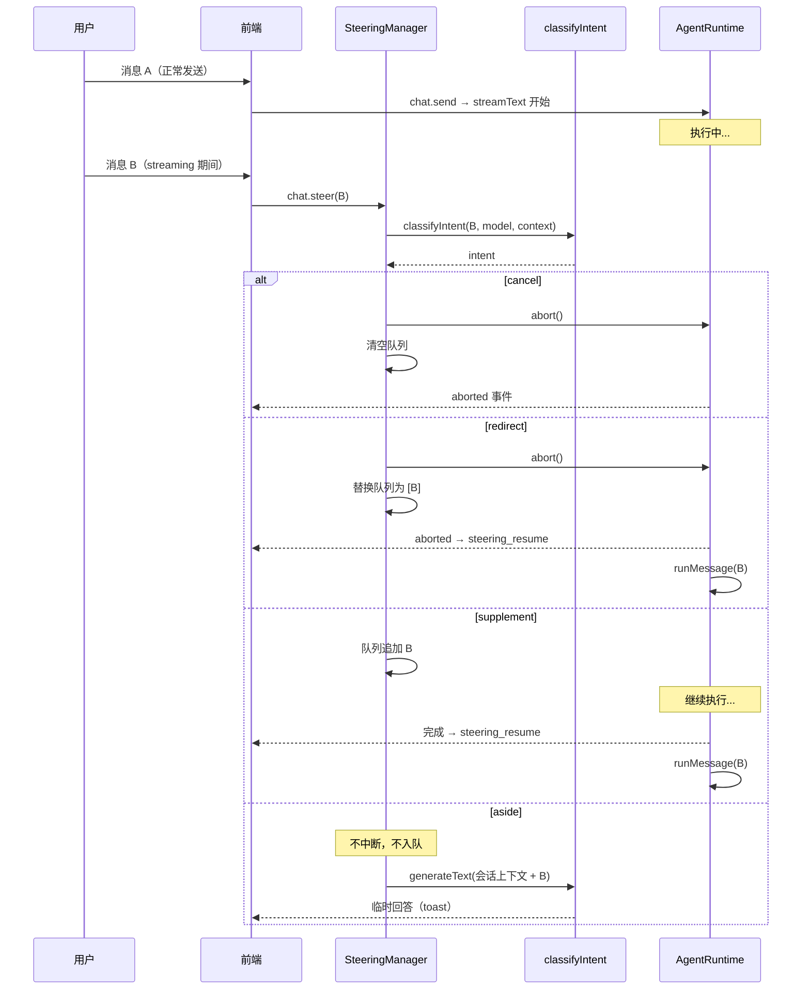
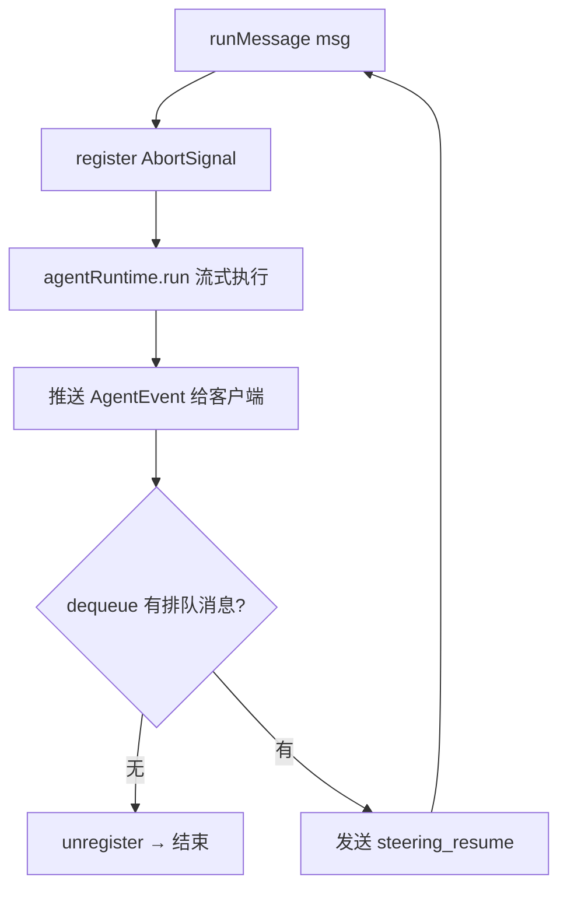
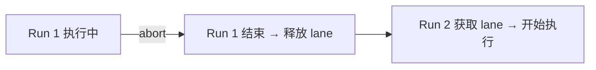

# 实时转向机制（Steering）

> 当 AI 正在执行任务时，用户随时可以取消、纠正、补充或提问。Steering 让用户始终掌控对话，而非被动等待。

灵感来自 Claude Code 的 [Interrupt and Steer](https://code.claude.com/docs) 理念——用户是循环的一部分，可以在任何节点介入。YanClaw 将这一理念扩展到多通道聊天场景，通过 LLM 意图分类自动决定如何响应用户的中途消息。

---

## 设计哲学

**问题**：传统聊天系统在 AI 响应期间要么锁定输入，要么简单排队。用户只能等，无法纠错。

**解决方案**：四种意图，四种响应策略。用户中途发送的消息不是噪声，而是有意图的信号：

| 用户想要… | 系统应该… | 意图 |
|---|---|---|
| 放弃当前任务 | 立即停止，不做后续 | **cancel** |
| 改变方向 | 停止当前，用新指令重来 | **redirect** |
| 追加要求 | 不打断，完成后继续 | **supplement** |
| 问个快速问题 | 不打断，不入队，立即回答 | **aside** |

---

## 工作流程



前端在用户发送消息时检测 `isStreaming` 状态——若正在流式输出，走 `chat.steer` 而非 `chat.send`。

---

## 意图分类

### LLM 分类（主路径）

`classifyIntent()` 使用轻量 LLM（fast/haiku 级别，`maxTokens: 1`）进行语义分类，能正确处理关键词匹配无法区分的场景：

| 消息 | 关键词匹配结果 | LLM 分类结果 | 原因 |
|---|---|---|---|
| "cancel my subscription" | cancel (误) | **supplement** | 描述需求，非取消指令 |
| "stop using the old API" | cancel (误) | **supplement** | 描述需求 |
| "actually, also add tests" | redirect (误) | **supplement** | 追加要求 |
| "这个端口号是多少？" | supplement | **aside** | 旁路提问 |

分类时传入当前任务摘要作为上下文，进一步提升歧义场景准确度。

### 快速路径（无歧义场景）

纯短关键词跳过 LLM 调用，零延迟：

| 意图 | 快速路径关键词 |
|---|---|
| **cancel** | `stop` `cancel` `abort` `停` `停止` `取消` `算了` `不用了` `别写了` `别做了` |
| **redirect** | `不对` `重新` `改为` `instead` 等（仅精确匹配） |

### 关键词回退

LLM 调用失败时自动回退到关键词匹配（`classifyByKeywords()`），确保服务不中断。

---

## 各意图详细行为

### Cancel — 立即停止

用户说"算了"，系统就停。不猜测，不追问。

1. `abortController.abort()` 中断 streamText
2. `pendingMessages = []` 清空队列
3. 已生成的文本保留，末尾标记 `[interrupted]`
4. 返回 `{ intent: "cancel", queued: false }`

### Redirect — 改变方向

用户说"不对，改为…"，系统中断当前任务并用新指令重来。

1. `abortController.abort()` 中断当前
2. **替换**（非追加）队列为新消息
3. 当前运行结束后，自动取出队列消息启动新一轮
4. 返回 `{ intent: "redirect", queued: true }`

### Supplement — 追加要求（最常见）

用户说"顺便也把…"，系统不打断，完成当前任务后接力执行。

1. 消息追加到 `pendingMessages` 队列（FIFO）
2. 当前运行**不中断**，继续执行
3. 完成后自动取出排队消息，逐条执行
4. 返回 `{ intent: "supplement", queued: true }`

### Aside — 旁路快速问答

借鉴 Claude Code 的 `/btw` 机制。用户问"这个端口号是多少来着？"，系统立即回答，不影响主任务。

1. **不中断**当前运行，**不入队**
2. 路由层读取会话上下文，调用 `generateText`（无工具，`maxTokens: 200`）
3. 返回 `{ intent: "aside", queued: false, answer: "..." }`
4. 前端显示为临时浮层（15 秒自动消失或手动关闭），不插入消息列表

**与 `/btw` 对比**：

| 特性 | Claude Code `/btw` | YanClaw aside |
|---|---|---|
| 触发方式 | 手动输入 `/btw` 前缀 | LLM 自动识别意图 |
| 上下文 | 完整对话上下文 | 最近 20 条消息 |
| 工具访问 | 无 | 无 |
| 对话历史 | 不进入 | 不进入 |
| 展示方式 | 可关闭 overlay | 临时 toast |

---

## 前端显式意图（零延迟路径）

`/steer` 接口支持可选 `intent` 参数，跳过 LLM 分类：

- **停止按钮** (■) → 直接调用 `POST /api/chat/cancel`，不经过分类
- **输入框发送** → 走 `steer` 接口，由 LLM 分类

前端已内置停止按钮。cancel 有零延迟的确定性路径，LLM 分类只处理输入框的自然语言消息。

---

## 服务端排队与重放

HTTP 和 WebSocket 入口采用相同的递归模式：



多条排队消息逐条取出、逐轮执行，直到队列清空。

### SteeringManager 数据结构

```typescript
active: Map<sessionKey, ActiveRun>

interface ActiveRun {
  abortController: AbortController;   // 中断 streamText
  pendingMessages: string[];           // 排队消息（FIFO）
}
```

每个 session 最多一个活跃运行。SteeringManager 本身是同步的——LLM 分类在路由层异步完成后，将结果传入 `steer(sessionKey, message, intent)`。

---

## 并发安全

### Session Lane 序列化

同一会话严格串行，不会并发执行两个 agent run：



`AgentRuntime.run()` 通过 `sessionLanes: Map<sessionKey, Promise<void>>` 实现锁机制。

### 断开连接清理

WebSocket 断开时，自动对该客户端所有活跃 session 执行清理：

- abort 残留的 AbortController
- 清空未处理的队列
- 从 active Map 中删除

---

## API 端点

| 端点 | 方法 | 用途 |
|---|---|---|
| `/api/chat/send` | POST | 正常发送（非 streaming 时） |
| `/api/chat/steer` | POST | streaming 期间发送转向消息。可选 `intent` 跳过分类 |
| `/api/chat/cancel` | POST | 强制取消当前运行 |
| WebSocket `chat.send` | JSON-RPC | 正常发送 |
| WebSocket `chat.steer` | JSON-RPC | 转向。可选 `intent` 参数 |
| WebSocket `chat.cancel` | JSON-RPC | 取消 |

---

## 关键文件

| 文件 | 职责 |
|---|---|
| `packages/server/src/agents/steering.ts` | SteeringManager（同步队列管理）、`classifyIntent`（async LLM 分类）、`classifyByKeywords`（快速路径） |
| `packages/server/src/agents/runtime.ts` | AgentRuntime，Session Lane，abort 处理 |
| `packages/server/src/routes/chat.ts` | HTTP 端点，LLM 分类调用，aside 回答生成，递归重放 |
| `packages/server/src/routes/ws.ts` | WebSocket 端点，同上 |
| `packages/server/src/db/sessions.ts` | `getLatestUserMessage()`、`getRecentMessages()` 提供分类上下文 |
| `packages/web/src/pages/Chat.tsx` | 前端分流，aside toast，steering_resume 处理 |
| `packages/web/src/lib/api.ts` | `steerChat()` API（支持可选 intent 参数） |
